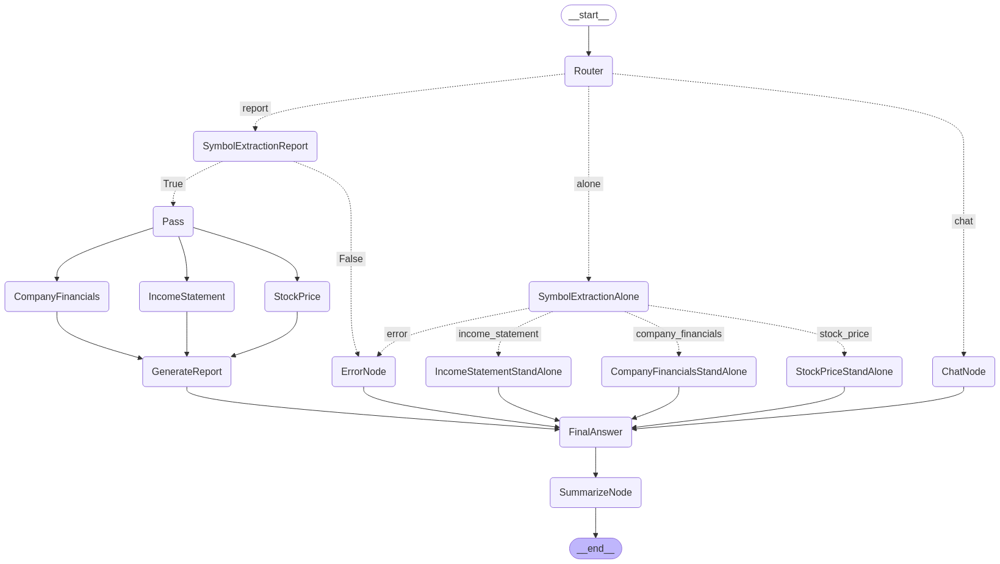

# 🚀 Financial Assistant: Intelligent Financial Data Assitent with Cross-Thread Memory

A sophisticated agentic system for financial data analysis, combining the power of LLMs, Langgraph orchestration, and real-time financial data APIs.

[Try it here](https://langgraph-sqtz5fcof3bdjce3w3gbun.streamlit.app/)

## 🌟 Key Features

### Core Functionality
- **Real-time Financial Data**: Get up-to-date stock prices, income statements, and company information
- **Intelligent Routing**: Automatically determines the most appropriate financial data to retrieve
- **Comprehensive Reporting**: Combines multiple data sources into coherent financial reports
- **Multi-Provider Support**: Works with Groq, OpenAI, or Anthropic LLMs

### New Features
- **Cross-Thread Memory Management**: Remembers companies and context between user interactions
- **Conversation Summarization**: Maintains an evolving summary of the conversation history
- **Symbol Persistence**: Remembers previously discussed stock symbols for more natural follow-up questions
- **Enhanced Context Awareness**: Uses conversation history to provide more relevant responses

## 🛠️ Technical Architecture

### Stack
- **Orchestration**: Langgraph for agent workflow management
- **LLM Providers**: GROQ with Llama 3.1 (default), OpenAI, or Anthropic
- **Financial Data**: Financial Modeling Prep API
- **Frontend**: Streamlit
- **Testing**: Pytest with comprehensive unit and integration tests

### System Components
1. **Router**: Analyzes user requests to determine the appropriate handling path
2. **Symbol Extraction**: Identifies company stock symbols in user requests
3. **Data Retrieval Nodes**: Fetch financial data from external APIs
4. **Report Generation**: Combines data into comprehensive reports
5. **Memory Manager**: Maintains conversation context across sessions
6. **Summarization**: Creates and updates conversation summaries for context awareness

### Workflow


## 💡 How It Works

1. **User Input**: The user submits a financial data request or question
2. **Request Analysis**: The system determines if the request is for a specific financial data point, a comprehensive report, or a general chat response
3. **Symbol Extraction**: The system extracts the relevant company symbol or falls back to the last discussed symbol
4. **Data Retrieval**: For financial requests, the system fetches the requested data from the Financial Modeling Prep API
5. **Response Generation**: The system formats the data into a readable response or generates a comprehensive report
6. **Memory Update**: The conversation is summarized and stored for future context

## 🚀 Getting Started

### Prerequisites
- Python 3.9+
- Financial Modeling Prep API key
- LLM provider API key (GROQ, OpenAI, or Anthropic)

### Installation

1. Clone the repository
   ```bash
   git clone https://github.com/yourusername/FinancialAssistant.git
   cd FinancialAssistant
   ```

2. Install dependencies
   ```bash
   pip install -r streamlit_app/requirements.txt
   ```

3. Configure API keys
   Create a `.env` file in the `streamlit_app/env` directory with:
   ```
   FINANCIAL_MODELING_PREP_API_KEY=your_fmp_api_key
   GROQ_API_KEY=your_groq_api_key
   OPENAI_API_KEY=your_openai_api_key
   ANTHROPIC_API_KEY=your_anthropic_api_key
   ```

4. Run the application
   ```bash
   cd streamlit_app
   streamlit run app.py
   ```

## 🧠 Memory Management System

The new memory management system enables:

- **Continuity**: The assistant remembers your previous questions about specific companies
- **Context Awareness**: Follow-up questions can reference previously discussed data
- **Symbol Persistence**: Ask "What about their income statement?" after discussing a company
- **Evolving Understanding**: The conversation summary adapts as you explore different financial topics

## 🔍 Example Usage

### Basic Stock Price Query
```
User: What's the current stock price of Apple?
Assistant: # Stock Price for (AAPL)
- Current Price: $222.50
- Volume: 35,396,922
- 50-Day Average Price: $223.07
- 200-Day Average Price: $195.38
- EPS: 6.57
- PE Ratio: 33.87
- Earnings Announcement: 2024-10-31
```

### Follow-up Query Using Memory
```
User: What about their income statement?
Assistant: # Income statement for (AAPL)
- Revenue: $383,285,000,000
- Gross Profit: $169,148,000,000
- Net Income: $96,995,000,000
- EBITDA: $125,820,000,000
- EPS: 6.16
- EPS (Diluted): 6.13
```

### Comprehensive Report
```
User: Can you generate a report for Microsoft?
Assistant: # Report for (MSFT)
...comprehensive financial data about Microsoft...
```

## 🤝 Contributing

Contributions are welcome! Please feel free to submit a Pull Request.

## 📝 License

This project is licensed under the MIT License - see the LICENSE file for details.

## 🙏 Acknowledgements

- Inspired by Hanane Dupouy's LLama Index agents implementation
- Built with [Langgraph](https://github.com/langchain-ai/langgraph) and [Streamlit](https://streamlit.io/)
- Financial data provided by [Financial Modeling Prep](https://financialmodelingprep.com/)

#FinancialTech #GenerativeAI #LLM #SoftwareEngineering #Innovation