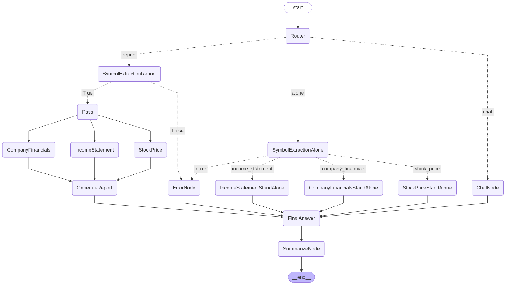

# 🔧 Built a Financial Agentic System: Combining Langgraph, GROQ, and APIs for Intelligent Financial Analysis

Inspired by Hanane Dupouy's LLama Index agents implementation, I developed a flexible agentic system with complete control over the agent's execution sequence.

# 🎯 What I Built:
A financial reporting system that intelligently gathers:  
• Real-time stock prices  
• Detailed income statements  
• Comprehensive company information 

# ⚙️ Technical Stack:
• Langgraph for orchestration  
• GROQ with Mistral (default LLM) - OpenAI/Anthropic or custom LLMs can be used interchangeably  
• Financial Modeling Prep API

# 💡 Key Aspects:
1. Full control over the agentic execution sequence
2. Concurrent data retrieval for optimal performance
3. Robust error handling for unknown companies
4. LLM-provider agnostic architecture

#FinancialTech #GenerativeAI #LLM #SoftwareEngineering #Innovation