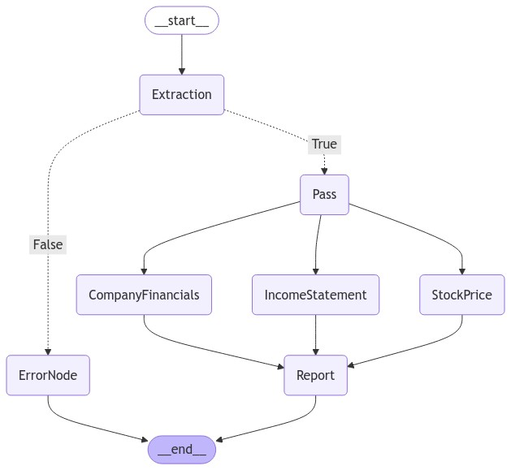

🔧 Built a Financial Agentic System: Combining Langgraph, GROQ, and APIs for Intelligent Financial Analysis

Inspired by Hanane Dupouy's [project](https://github.com/hananedupouy/LLMs-in-Finance/tree/main/Agents/Anthropic)

The purpose of this project is to show practical usage of current (2024) AI technologies  

🎯 What I Built:

A financial reporting system that intelligently gathers:

• Real-time stock prices

• Detailed income statements

• Comprehensive company information

⚙️ Technical Stack:

• Langgraph for orchestration

• GROQ with Mistral (default LLM) - OpenAI/Anthropic or custom LLMs can be used interchangeably

• Financial Modeling Prep API

💡 Key Innovations:

1. Full control over the agentic execution sequence

2. Concurrent data retrieval for optimal performance

3. Robust error handling for unknown companies

4. LLM-provider agnostic architecture

#FinancialTech #GenerativeAI #LLM #SoftwareEngineering #Innovation
